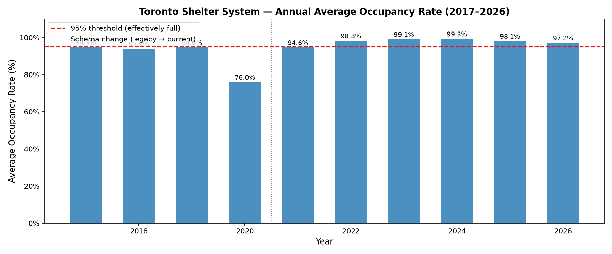
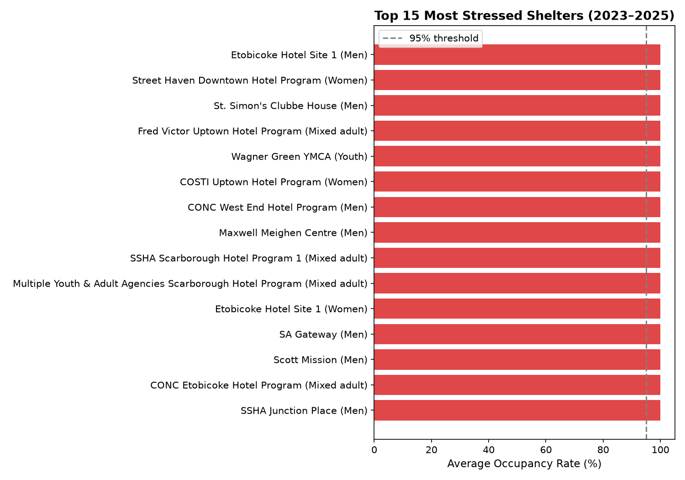
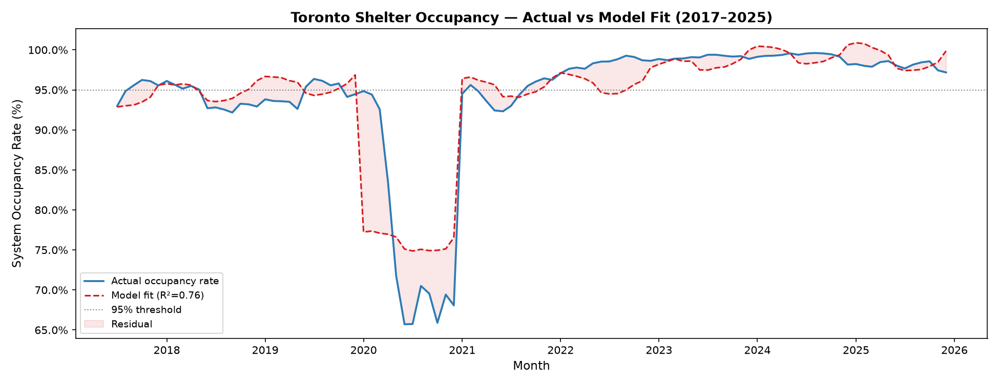
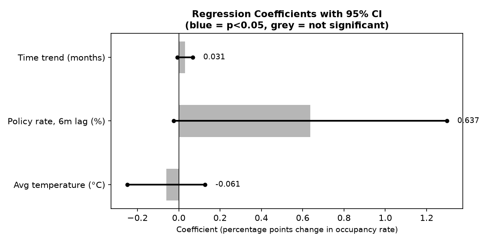
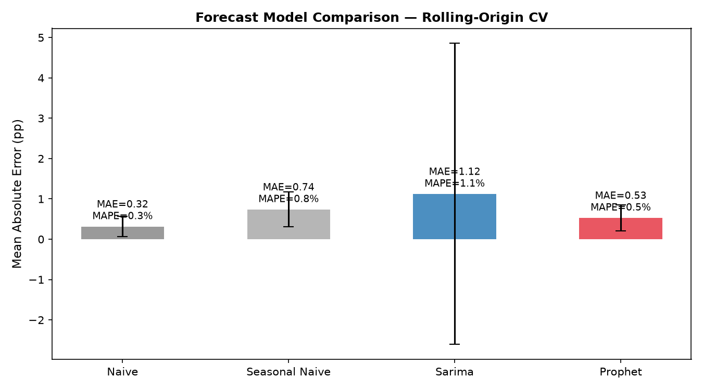
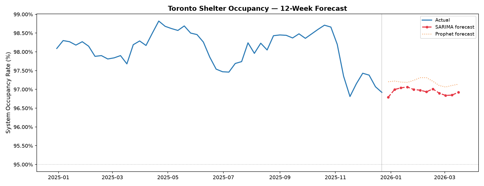

# Toronto Housing & Homelessness Analytics Platform

An end-to-end data platform linking **macro-financial indicators** (Bank of Canada policy rate, rental market stress) to social infrastructure demand — built to demonstrate production-grade data engineering, statistical modeling, and time-series forecasting.

> **Finance relevance:** This project treats shelter occupancy as an *alternative data signal* for housing market stress — the same analytical pattern used by real estate investment teams, credit risk analysts, and macro research desks to monitor affordability and forecast demand.

---

## What This Project Does

**Three questions, three analytical layers:**

| Question | Method | Key Finding |
|----------|--------|-------------|
| Where is the shelter system under most stress? | Descriptive analytics, geographic concentration (Folium) | 79% of programs at 95%+ occupancy since 2023. Stress concentrated in downtown core. |
| How do macro-financial forces relate to shelter demand? | OLS regression: BoC policy rate, temperature, time trend | Policy rate has a +0.64pp effect per 1% increase (6-month lag, p=0.059). Demand is structural, not seasonal. |
| Can we forecast shelter demand accurately? | SARIMA, Prophet, rolling-origin CV (37 folds) | System is saturated at 97-99% — naive baseline wins (MAE=0.32pp). The forecast IS the finding: no slack remains. |

---

## Architecture

Data Sources --> Python Ingestion + Caching --> DuckDB Warehouse --> dbt Core Star Schema --> Analysis (statsmodels, SARIMA, Prophet) --> Outputs (Folium Map, Matplotlib Charts)

---

## Tech Stack

| Layer | Technology | Why |
|-------|-----------|-----|
| **Warehouse** | DuckDB | Columnar analytics engine — same SQL as Snowflake/BigQuery, zero infrastructure |
| **Transformation** | dbt Core | Tested star schema (18 tests passing), staging to mart pattern |
| **Ingestion** | Python, requests | Cached API pulls with TTL, idempotent load-and-replace |
| **Statistical** | statsmodels (OLS) | Regression with VIF diagnostics, Durbin-Watson, confidence intervals |
| **Forecasting** | SARIMA, Prophet | Rolling-origin CV (not k-fold — temporal data leakage prevention) |
| **Visualization** | Folium, Matplotlib | Interactive satellite map with sector filters + publication-quality charts |
| **Testing** | pytest (8 tests), dbt tests (18) | Cache behavior, DuckDB load semantics, not_null/unique/accepted_values |

---

## Data Sources

All public, all verified, all documented in docs/data_sources.md.

| Source | Provider | Finance Relevance |
|--------|----------|-------------------|
| Daily Shelter Occupancy | City of Toronto Open Data | Demand signal — leading indicator of housing market pressure |
| Bank of Canada Policy Rate | Bank of Canada Valet API | Macro transmission channel: rates to mortgage costs to affordability |
| CMHC Rental Market Survey | CMHC | Vacancy rates + avg rents — core housing affordability metrics |
| Census Income/Demographics | Statistics Canada | Income distribution, rent-to-income burden ratios |
| Historical Weather | Environment Canada | Exogenous feature for demand forecasting (cold = higher demand) |

---

## Key Results

### 1. System Saturation
Toronto shelter system has operated at **97-99% occupancy** every week since 2022. Multiple programs have been at **100% capacity every single day** for 4 consecutive years.

### 2. Macro-Financial Transmission
The Bank of Canada policy rate shows a **+0.64 percentage point** increase in shelter occupancy per 1% rate hike, with a 6-month lag (p=0.059). This is the expected direction from housing affordability theory: rate increases lead to higher mortgage/rent costs lead to increased housing stress.

**Causal caveat:** This is a correlation in an observational study. Rate hikes coincided with post-COVID housing market stress — we cannot isolate the rate effect from other simultaneous changes. Documented honestly throughout.

### 3. Forecasting at Saturation
The naive baseline (forecast = last weeks value) beats SARIMA and Prophet because the system is **pinned at its capacity ceiling**. The series barely moves — MAPE of 0.32% means we are off by less than a third of a percentage point.

**Finance analogy:** A portfolio running at its risk limit is highly predictable day-to-day but has zero buffer for shocks. The forecast tells you the system is stable; the lack of slack tells you it is fragile.

---

## Star Schema (dbt)

- **dim_date** — 3,484 days (2017-2026) with season, quarter, weekend flags
- **dim_shelter** — 148 unique shelter locations with FSA, organization, sector
- **fact_shelter_daily** — 433,362 rows, grain = program + day. Occupancy rate, capacity, stress flags.
- **fact_housing_monthly** — 115 months joining shelter aggregates + BoC rate + weather

All models tested: dbt test produces 18/18 passing. Schema documented in staging.yml.

---

## Project Structure

- **ingestion/** — Python scripts: CKAN API, BoC Valet, ECCC weather, cached with TTL
- **dbt_project/** — dbt Core + DuckDB: 5 staging views, 4 mart tables
- **analysis/** — Descriptive trends, interactive map, OLS regression
- **forecasting/** — SARIMA, Prophet, rolling-origin cross-validation (37 folds)
- **docs/** — data_sources.md (every dataset), metric_definitions.md (every formula)

---

## How to Run

1. Clone and set up: git clone, python3 -m venv .venv, pip install -r requirements.txt
2. Ingest data: python3 -m ingestion.scripts.run_all shelter boc weather
3. Build dbt: cd dbt_project && dbt deps && dbt run && dbt test
4. Analysis: python3 -m analysis.scripts.occupancy_trends
5. Map: python3 -m analysis.scripts.shelter_map
6. Regression: python3 -m analysis.scripts.regression_analysis
7. Forecasting: python3 -m forecasting.models.shelter_forecast

---

## Metric Definitions

Every number in this project traces to docs/metric_definitions.md. Key metrics:

- **Occupancy Rate** = Occupied / Actual Capacity x 100 (not funding capacity)
- **Effectively Full** = Program running at 95%+ occupancy rate
- **System Occupancy Rate** = total occupied across all programs / total actual capacity (never average the rates)

---

## Data Quality Issues Encountered and Resolved

- **2-digit year dates** from CKAN API (2021-2022 resources returned 21-xx-xx instead of 2021-xx-xx) — fixed in ingestion with regex date repair
- **Mixed date formats** in legacy shelter data (2017-2019 ISO format, 2020 MM/DD/YYYY) — handled with CASE statement in dbt staging
- **Empty strings in numeric columns** (OCCUPIED_BEDS) — resolved with try_cast in dbt
- **DuckDB UNION ALL type resolution** mangling dates across strptime and cast — fixed with explicit ::date cast

---

## Author

**Ayokunmi Lawal** — York University, Data Science (Honours) + Finance Minor
[GitHub](https://github.com/ayokumo)
